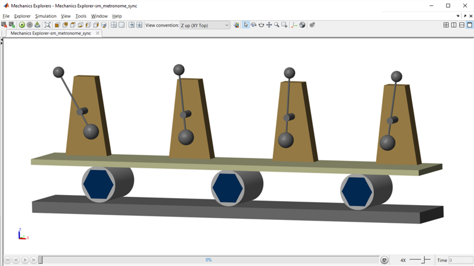

# **Metronome Synchronization in Simscape&trade;**
Copyright 2022 The MathWorks, Inc.

This example models metronomes on a moving platform.  They start out of phase, 
but as the platform moves, they synchronize.  This is an example of a system
that follows the Kuramoto model.

Open the project file Metronome_Synchronization.prj to get started.

To learn more about modeling and simulation with Simscape, please visit:
* [Simscape Getting Started Resources](https://www.mathworks.com/solutions/physical-modeling/resources.html)
* Product Capabilities:
   * [Simscape&trade;](https://www.mathworks.com/products/simscape.html)
   * [Simscape Driveline&trade;](https://www.mathworks.com/products/simscape-driveline.html)
   * [Simscape Electrical&trade;](https://www.mathworks.com/products/simscape-electrical.html)
   * [Simscape Fluids&trade;](https://www.mathworks.com/products/simscape-fluids.html)
   * [Simscape Multibody&trade;](https://www.mathworks.com/products/simscape-multibody.html)
